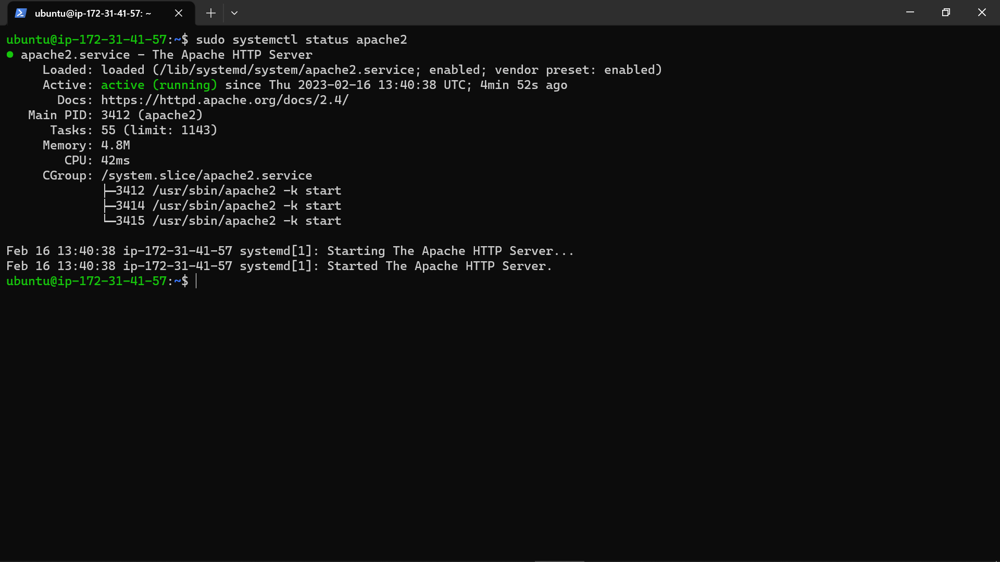
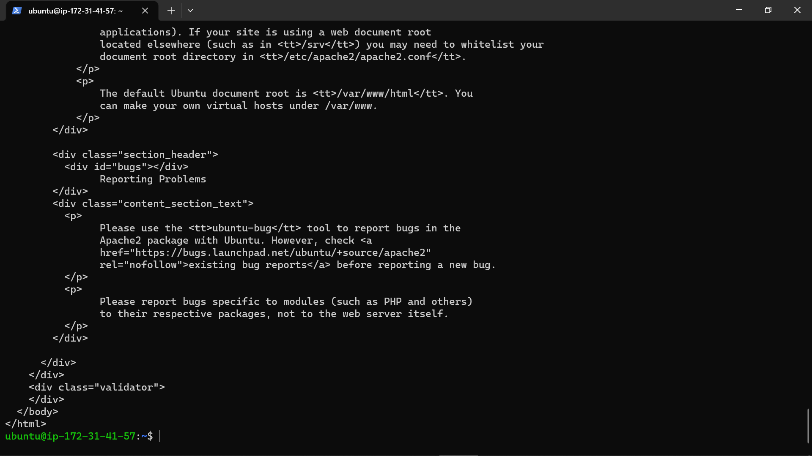

# PROJECT 1 DOCUMENTATION

## Installing Apache & Updating The Firewall
---

I installed Apache on my Ubuntu OS by running the following commands:

`
sudo apt update
`
: This updates ubuntu packages

`
sudo apt install apache2
`
: This installs the latest version of apache

`
sudo system ctl status apache2
`
: This starts and shows the status of the apache server installed.

Find below the screenshot of the successful apache web server installation.

---

## Acessing My Apache Server Locally (Ubuntu) & From the Internet (Browser)

`
curl http://localhost
`
: which accesses the apache server from my ubuntu server and displays the text image below.

`
http:18.223.166.172/
`
: which accesses the apache server from my web browser and displays the succes image below.
